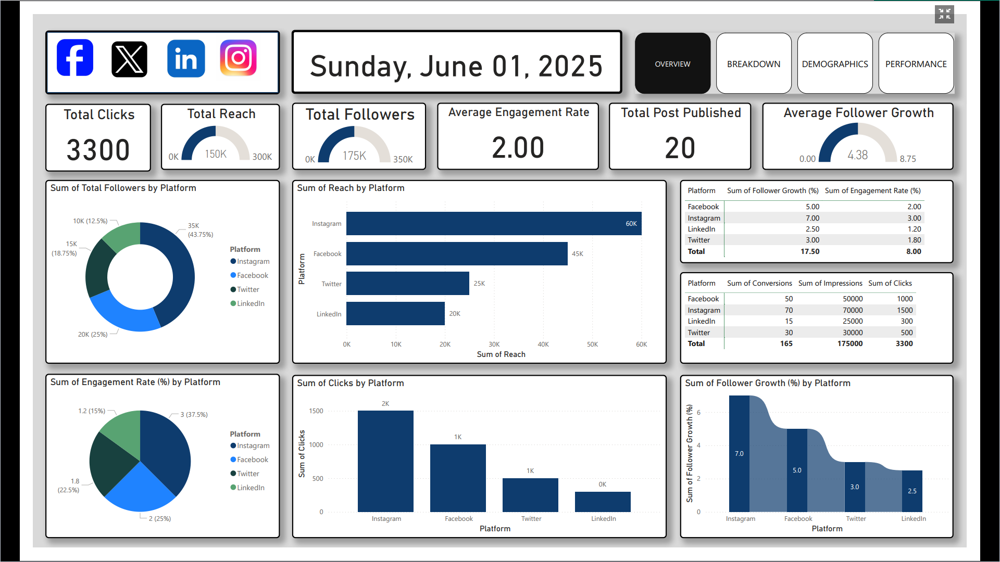
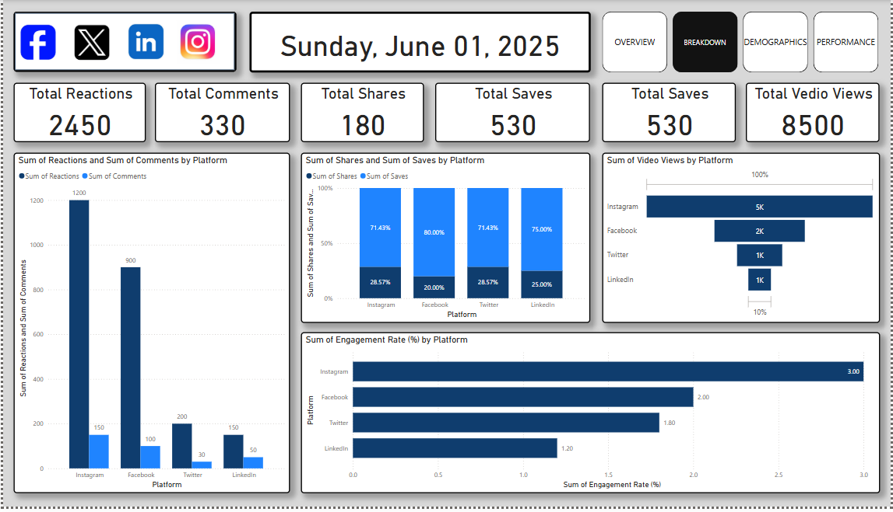
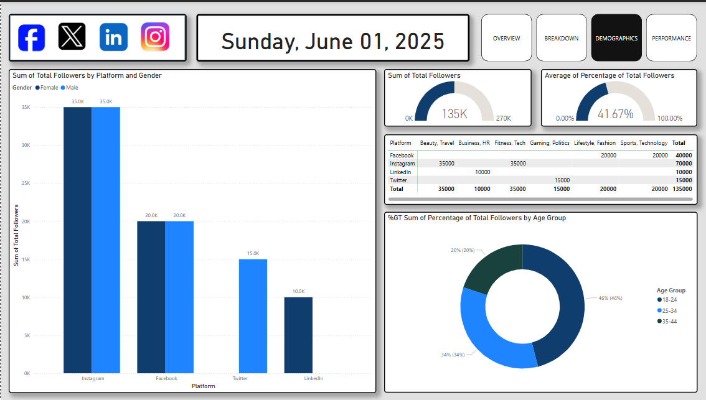
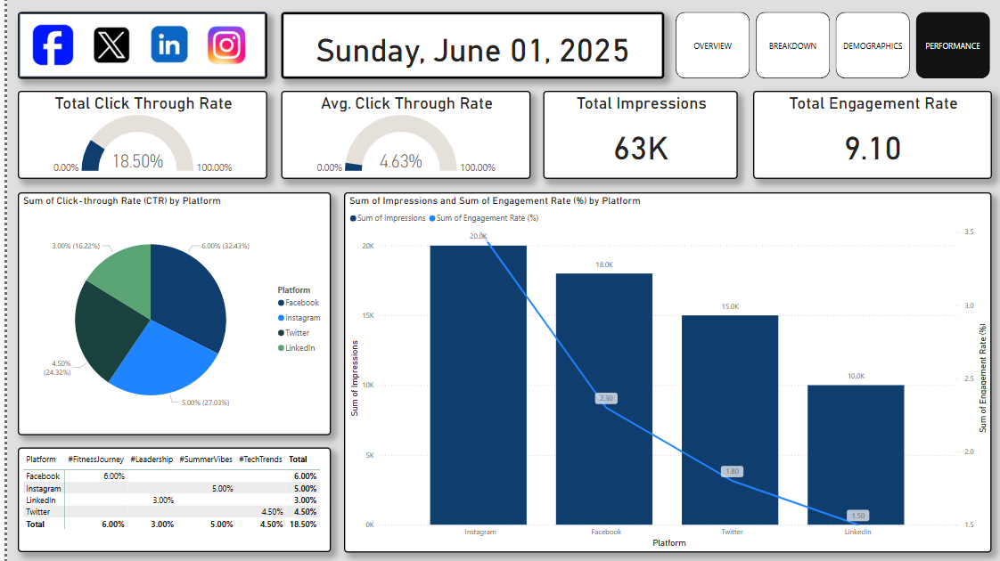

# Social Media Performance Dashboard

## Project Overview

This project is focused on developing a **Social Media Performance Dashboard** to analyze key metrics across multiple social media platforms including **Facebook**, **Instagram**, **Twitter**, and **LinkedIn**. The goal is to provide a clear, insightful, and visually appealing dashboard that helps track and measure various performance indicators such as **Click-Through Rates (CTR)**, **Engagement Rates**, **Impressions**, **Shares**, **Reactions**, **Video Views**, and **Follower Demographics**.

The dashboard is designed to visualize the performance of posts, helping users and businesses optimize their social media strategies by identifying which platforms and types of content are generating the most engagement. The project uses various visual components like bar charts, pie charts, and line graphs to present the data clearly, making it easy to assess the overall success and audience reach of social media campaigns.

---

## 

### 1. **Overview**
   
  
The **Overview** page provides a high-level snapshot of all the essential social media metrics. This page is the starting point for users to assess the overall health of their social media campaigns. It consolidates core metrics to offer a clear understanding of the campaign's reach and engagement.

- **Sum of Total Click-through Rate (CTR)**: Displays the total CTR, helping users gauge how well their posts are encouraging users to click on external links.
- **Sum of Total Impressions**: Reflects the total number of times content was displayed, providing insights into how visible the posts are across various platforms.
- **Sum of Total Engagement Rate**: This combines likes, shares, comments, and other interactions into a single metric to measure how engaging the content has been.

This page enables users to easily compare the performance of different platforms and identify which ones are providing the best reach and engagement. It provides a solid foundation for evaluating the success of the content strategy.

---

### 2. **Breakdown**
   
  
The **Breakdown** page provides a deeper dive into the individual forms of engagement with the content. It breaks down the data into specific actions that users take on social media posts.

- **Total Reactions**: Tracks the total number of reactions (likes, loves, etc.) on posts across platforms. A higher number of reactions indicates that content is resonating well with the audience.
- **Total Comments**: Displays the total number of comments on posts, providing insight into how thought-provoking and engaging the content is.
- **Total Shares**: Measures how many times content has been shared, which is a key indicator of how viral or widely appreciated the content is.
- **Total Saves**: Shows how many times posts have been saved for later viewing, which suggests that the content holds long-term value for users.
- **Video Views**: This section tracks the number of video views, which is crucial for platforms where video content drives engagement (like Instagram and Facebook).

By analyzing these metrics, users can determine which aspects of their content (reactions, comments, shares, etc.) are generating the most engagement and optimize their strategy accordingly.

---

### 3. **Demographics**
   
  
The **Demographics** page offers a breakdown of the audience engaging with the posts, providing valuable insights into their gender and age groups. Understanding the demographics is key for tailoring content that appeals to specific segments of the audience.

- **Total Followers by Gender**: This section shows the distribution of followers by gender, helping users understand the gender balance of their audience on each platform. For example, if Instagram has a higher percentage of female followers, content can be adjusted to appeal to that demographic.
- **Age Group Breakdown**: Provides insights into the age groups that are most active in engaging with the content. It can reveal trends, such as younger users being more active on Instagram, while older users may prefer Facebook.
- **Follower Distribution by Platform**: This data shows how followers are spread across different platforms, helping to identify where the audience is most engaged. This can inform decisions on where to focus marketing efforts.

The **Demographics** page helps content creators and businesses optimize their social media content by catering to the specific preferences and interests of their audience segments.

---

### 4. **Performance**
   
  
The **Performance** page is the heart of the dashboard, providing detailed insights into key performance metrics such as **Click-Through Rate (CTR)**, **Impressions**, and **Engagement Rate**.

- **Total Click-Through Rate (CTR)**: Shows the overall CTR for all posts, helping users assess how successful their posts are in driving traffic.
- **Average Click-Through Rate (CTR)**: Provides the average CTR for comparison, allowing users to gauge if their current posts are underperforming or exceeding expectations.
- **Total Impressions**: This metric shows how many times content was displayed across platforms, helping to measure the reach of each post.
- **Total Engagement Rate**: Combines all interactions (likes, comments, shares) to calculate the overall engagement rate, providing a sense of how well the audience is interacting with the content.

The **Performance** page enables users to identify which posts are performing well and which ones are not. By comparing the **CTR** and **Engagement Rate** across platforms, users can determine where to allocate resources to improve content strategy.

---

## Skills Demonstrated

- **Data Visualization**: Expertise in creating interactive, user-friendly dashboards using Power BI or Tableau to represent complex data clearly.
- **Data Analysis**: Ability to analyze social media performance metrics such as CTR, engagement, and demographic breakdown to derive actionable insights.
- **Front-End Development**: Proficiency in HTML, CSS, and JavaScript to create a visually appealing and responsive user interface for displaying key performance metrics.
- **Backend Integration**: Experience in integrating data from social media platforms through APIs and handling large data sets for real-time analytics.
- **Business Intelligence**: Use of data-driven insights to optimize social media strategies, enhance engagement, and drive business outcomes.

---

## Connect with Me

Feel free to reach out for any inquiries, collaborations, or feedback:

- **Name**: Akil Aktab Alok
- **LinkedIn**: [Akil Aktab Alok](https://www.linkedin.com/in/akil-aktab-alok)

---
